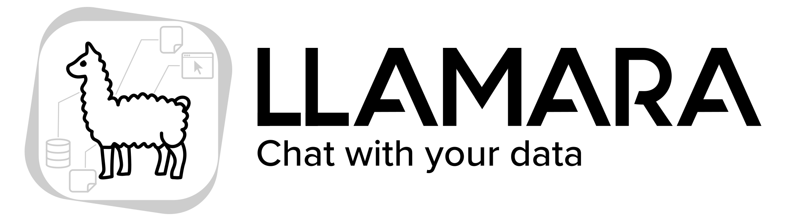

# LLAMARA - Large Language Assistant for Model-Augmented Retrieval and Analysis

LLAMARA - Large Language Assistant for Model-Augmented Retrieval and Analysis - is an LLM-based assistant developed to facilitate information retrieval from a provided knowledge base.

Initially designed to support researchers working with scientific papers, whitepapers, and documentation,
LLAMARA has also proven useful for students working with lecture slides. It efficiently handles large datasets, accurately identifying and retrieving relevant information.
Additionally, LAMARA ensures full transparency by providing sources with references to the knowledge base, making research findings accessible to both researchers and the public.
